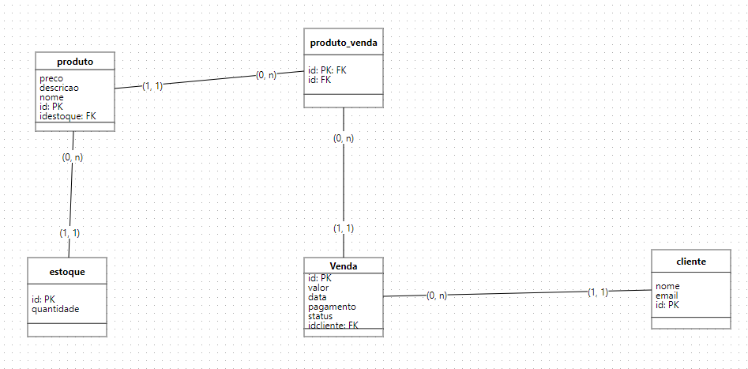

<h1>Titulo ou Arte do Projeto</h1> 

<p align="center">
  
  
  
</p>

> Status do Projeto: :heavy_check_mark: (concluido)

### Tópicos 

:small_blue_diamond: [Descrição do projeto](#descrição-do-projeto)

:small_blue_diamond: [Funcionalidades](#funcionalidades)

:small_blue_diamond: [Rotas ](#rotas)

:small_blue_diamond: [Pré-requisitos](#pré-requisitos)

:small_blue_diamond: [Como rodar a aplicação](#como-rodar-a-aplicação-arrow_forward)


## Descrição do projeto 

<p align="justify">
  uma API de um e-commerce de vendas online, tendo um banco de dados relacional. A API responde um CRUD sendo um produto, com um estoque, uma relação de 0..n e 0..n entre produtos e vendas, e a venda tem uma relação com clientes, como mostra a a imagem abaixo.
</p>



## Funcionalidades

:heavy_check_mark: CRUD de produtos

:heavy_check_mark: CRUD de estoque

:heavy_check_mark: CRUD de vendas

:heavy_check_mark: CRUD de clientes

## Pré-requisitos

:warning: [Node](https://nodejs.org/en/download/)

:warning: [Npm](https://docs.npmjs.com/downloading-and-installing-node-js-and-npm/)


## Como rodar a aplicação :arrow_forward:

No terminal, clone o projeto: 

```
git clone https://github.com/jpadedg/vendas_backend.git
```

```
$ cd vendas_backend
```

```
$ npm i
```

```
$ npm start
```

## Casos de Uso

Explique com mais detalhes como a sua aplicação poderia ser utilizada. O uso de **gifs** aqui seria bem interessante. 

Exemplo: Caso a sua aplicação tenha alguma funcionalidade de login apresente neste tópico os dados necessários para acessá-la.

## JSON :floppy_disk:

### Venda: 

|id|valor|data|pagamento|status|idcliente|
| -------- |-------- |-------- |-------- |-------- |-------- |
|6|150|2023-11-07|pix|concluida|4

... 

Se quiser, coloque uma amostra do banco de dados 

## Iniciando/Configurando banco de dados

```
Para que o projeto funcione corretamente é necessario realizar a configuração do banco de dados relacional. 

Script a Seguir
```

```
CREATE TABLE produto 
( 
 preco INT NOT NULL,  
 descricao VARCHAR(255) NOT NULL,  
 nome VARCHAR(255) NOT NULL,  
 id INT PRIMARY KEY AUTO_INCREMENT,  
 idestoque INT  not null unique
); 

CREATE TABLE estoque 
( 
 id INT PRIMARY KEY AUTO_INCREMENT,  
 quantidade INT NOT NULL DEFAULT '0' 
); 

CREATE TABLE cliente 
( 
 nome VARCHAR(255) NOT NULL,  
 email VARCHAR(255) NOT null UNIQUE,  
 id INT PRIMARY KEY AUTO_INCREMENT  
); 

CREATE TABLE produto_venda 
( 
 id INT PRIMARY key AUTO_INCREMENT,  
 idVenda INT,  
 idProduto INT  
); 

CREATE TABLE venda 
( 
 id INT PRIMARY key AUTO_INCREMENT,  
 valor INT,  
 data DATE,  
 pagamento varchar(255),  
 status varchar(255),  
 idcliente INT not null
); 

ALTER TABLE produto ADD FOREIGN key (idestoque) REFERENCES estoque (id)
ALTER TABLE venda ADD FOREIGN KEY(idCliente) REFERENCES cliente (id)
ALTER TABLE produto_venda ADD FOREIGN KEY(idVenda) REFERENCES venda (id)
ALTER TABLE produto_venda ADD FOREIGN KEY(idProduto) REFERENCES produto (id)
```

## Rotas 

```
Rotas de Estoque: 

router.post('/estoque', estoqueController.adicionarEstoque);
router.get('/estoque/:id', estoqueController.buscarEstoque);
router.put('/estoque/:id', estoqueController.alterar);
router.delete('/estoque/:id', estoqueController.apagar);

```

```
Rotas de Clientes: 

router.get('/clientes', clienteController.buscarTodos);
router.get('/cliente/:id', clienteController.buscarCliente);
router.post('/cliente', clienteController.adicionarCliente);
router.put('/cliente/:id', clienteController.alterar);
router.delete('/cliente/:id', clienteController.apagar);

```

```
Rotas de Produtos: 

router.get('/produto/', produtoController.buscarTodos);
router.get('/produto/:id', produtoController.buscarProduto);
router.post('/produto', produtoController.adicionarProduto);
router.put('/produto/:id', produtoController.alterar);
router.delete('/produto/:id', produtoController.apagar);

```

```
Rotas de Produtos_Venda: 

router.get('/produtoVenda/', produtoVendaController.buscarTodos);
router.post('/produtoVenda', produtoVendaController.adicionarProdutoVenda);
router.delete('/produtoVenda/:id', produtoVendaController.apagar);

```

```
Rotas de Produtos_Venda: 

router.get('/venda/', vendaController.buscarTodos);
router.post('/venda', vendaController.adicionarVenda);
router.put('/venda/:id', vendaController.alterar);
router.delete('/venda/:id', vendaController.apagar);

```


## Linguagens, dependencias e libs utilizadas :books:

- [Dotenv](https://www.npmjs.com/package/dotenv)

- [Nodemon](https://www.npmjs.com/package/nodemon)


## Licença 

The [MIT License]() (MIT)

Copyright :copyright: 2023 - API-Vendas-Backend 